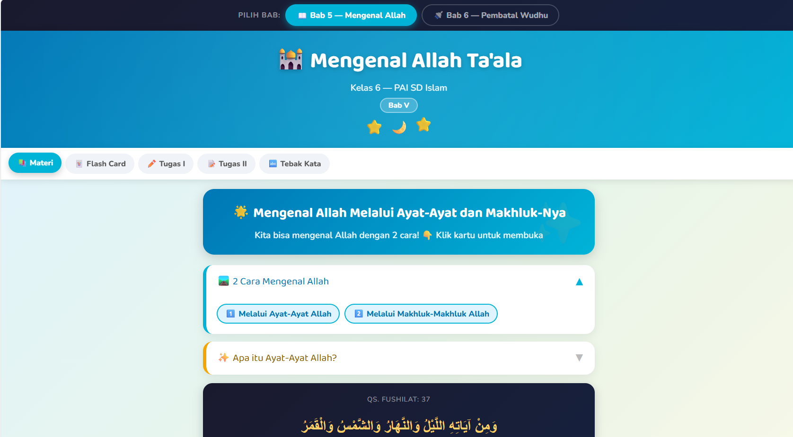
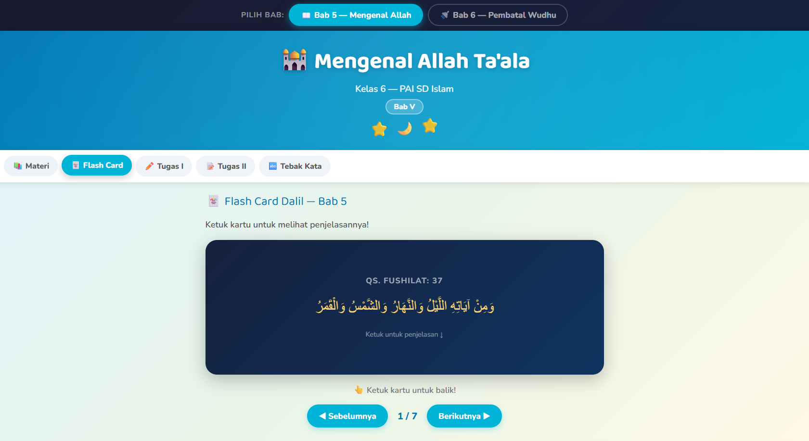
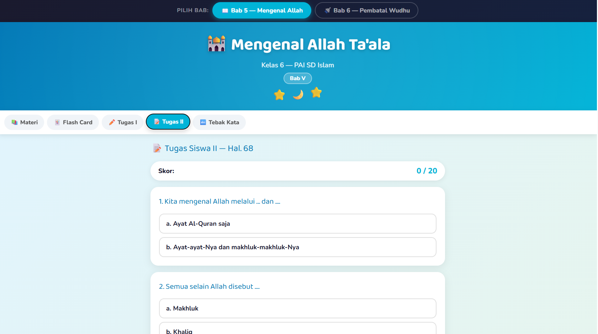
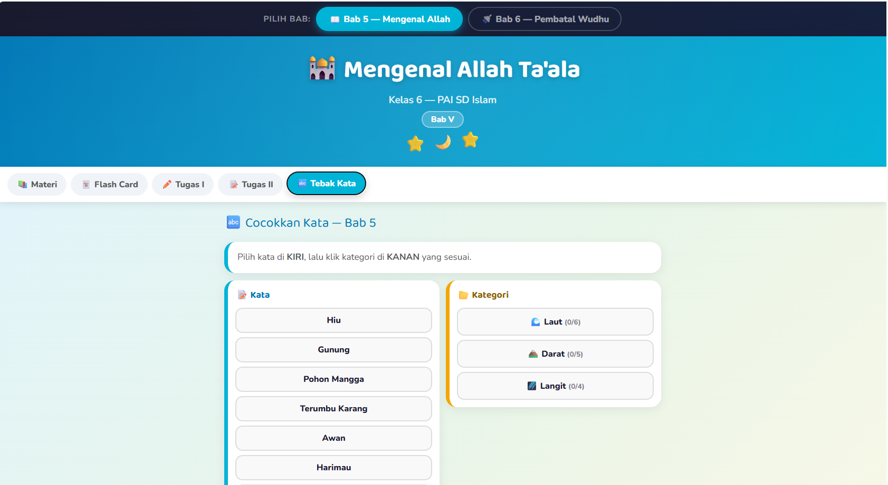

# 📚 Belajar PAI — Kelas 6 SD Islam

Web app interaktif untuk belajar Pendidikan Agama Islam (PAI) kelas 6 SD. Mencakup **5 Bab** lengkap dengan materi accordion, flash card dalil, animasi, dan latihan soal.

---

## 🗂️ File

| File | Keterangan |
|------|------------|
| `index.html` | File utama — buka langsung di browser, tidak perlu server |

---

## ✨ Fitur Utama

- **5 Bab dalam 1 file** — beralih antar bab cukup dengan 1 klik
- **Materi Accordion** — kartu tertutup by default, klik untuk membuka; tidak mengganggu fokus
- **Flash Card Dalil** — kartu bolak-balik dengan teks Arab + terjemah
- **Animasi SVG** — animasi sains Islam menyatu di dalam materi (gerhana, siang-malam, tumbuhan, batal/tidak wudhu)
- **Latihan Soal Interaktif** — Tugas I (centang/silang), Tugas II (pilihan ganda), Tebak Kata (kiri-kanan)
- **Offline-ready** — tidak butuh internet setelah dimuat (kecuali font Google Fonts)

---

## 📖 Isi Per Bab

| Bab | Topik | Warna |
|-----|-------|-------|
| 📖 **Bab V** | Mengenal Allah melalui Ayat-Ayat dan Makhluk-Nya | 🔵 Teal |
| 🚿 **Bab VI** | Pembatal-Pembatal Wudhu | 🟠 Oranye |
| 👂 **Bab VII** | Allah Maha Mendengar — As-Sami' (اَلسَّمِيعُ) | 🔷 Indigo |
| 🕌 **Bab VIII** | Shalat-Shalat Fardhu | 🟢 Emerald |
| 🧠 **Bab IX** | Allah Maha Mengetahui — Al-'Aliim (اَلْعَلِيمُ) | 🔴 Crimson |

---

## 🎮 Tab Per Bab

Setiap bab memiliki 5 tab latihan:

| Tab | Isi |
|-----|-----|
| 📚 **Materi** | Accordion interaktif: materi, dalil Arab, animasi SVG, penjelasan |
| 🃏 **Flash Card** | 6–7 kartu bolak-balik: depan = teks Arab, belakang = terjemah & penjelasan |
| ✏️ **Tugas I** | 20 item klik-tandai (centang/silang) sesuai kategori |
| 📝 **Tugas II** | 20 soal pilihan ganda dengan feedback warna + nilai akhir |
| 🔤 **Tebak Kata** | Cocokkan kata (kiri) dengan kategori (kanan) — drag-free, klik saja |

---

## 🎬 Animasi yang Ada

| Bab | Animasi |
|-----|---------|
| Bab V | 🌑 Gerhana Matahari Total (bulan bergerak) |
| Bab V | 🌅 Pergantian Siang & Malam (matahari melengkung, langit berubah warna) |
| Bab V | 🌱 Pertumbuhan Pohon Mangga (5 tahap: biji → berbuah) |
| Bab VI | ❓ Batal atau Tidak? (4 skenario cycling otomatis, 5 detik per frame) |

---

## 📸 Screenshot

| Tampilan | Keterangan |
|----------|------------|
|  | Tab Materi — Bab 5, accordion terbuka |
|  | Tab Flash Card — kartu dengan teks Arab |
|  | Tab Tugas II — pilihan ganda |
|  | Tab Tebak Kata — cocokkan kiri-kanan |

---

## 🚀 Cara Pakai

```
1. Download file belajar-pai-bab5-bab6.html
2. Buka di browser (Chrome / Firefox / Safari)
3. Pilih bab di bagian atas
4. Pilih tab yang diinginkan
5. Selamat belajar! 🌟
```

> Tidak perlu install apapun. Tidak butuh koneksi internet (setelah halaman dimuat).

---

## 🛠️ Teknologi

- **HTML5** + **CSS3** (CSS Variables, Grid, Flexbox, Transitions)
- **Vanilla JavaScript** — tanpa framework/library
- **SVG Animation** — animasi sains murni SVG, tidak butuh canvas
- **Google Fonts** — Baloo 2 & Nunito

---

## 👦 Target Pengguna

Siswa kelas 6 SD Islam — didesain dengan:
- Font besar (base 18px) agar mudah dibaca
- Warna cerah dan berbeda per bab
- Interaksi sederhana (klik/tap)
- Animasi yang menarik perhatian tapi tidak mengganggu

---

## 📝 Lisensi

Dibuat untuk keperluan edukasi. Materi bersumber dari buku PAI SD Islam kelas 6.
