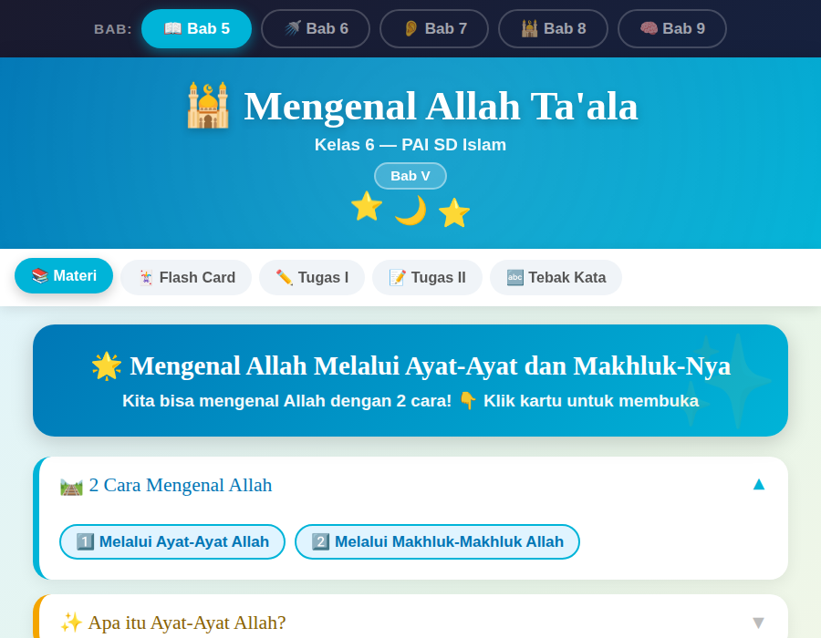
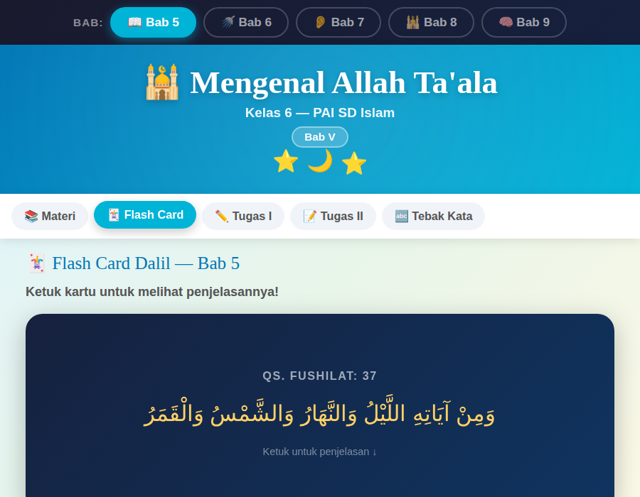
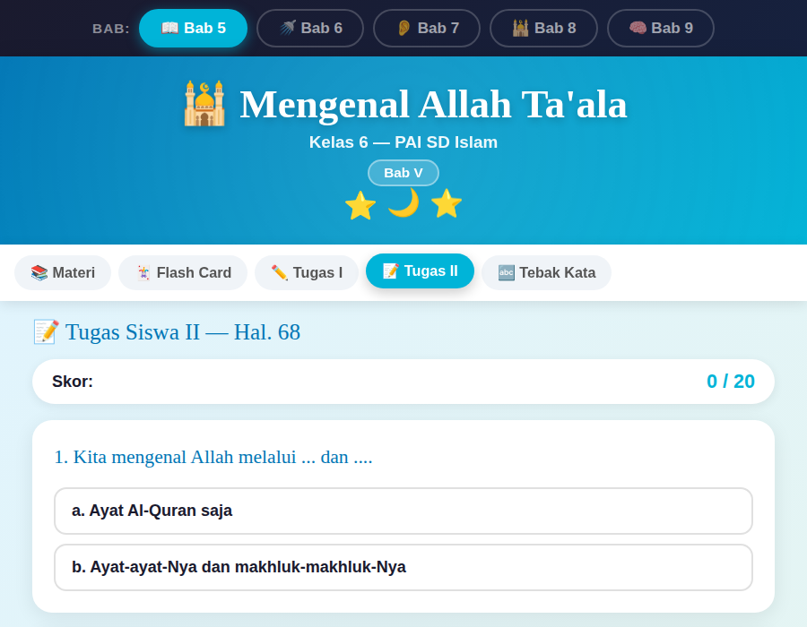
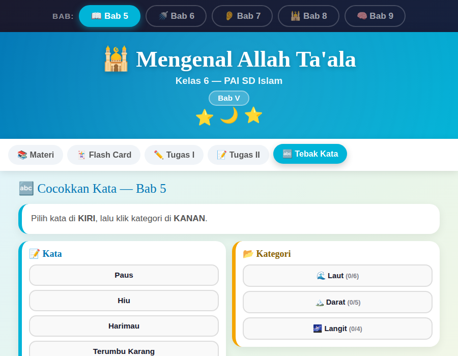
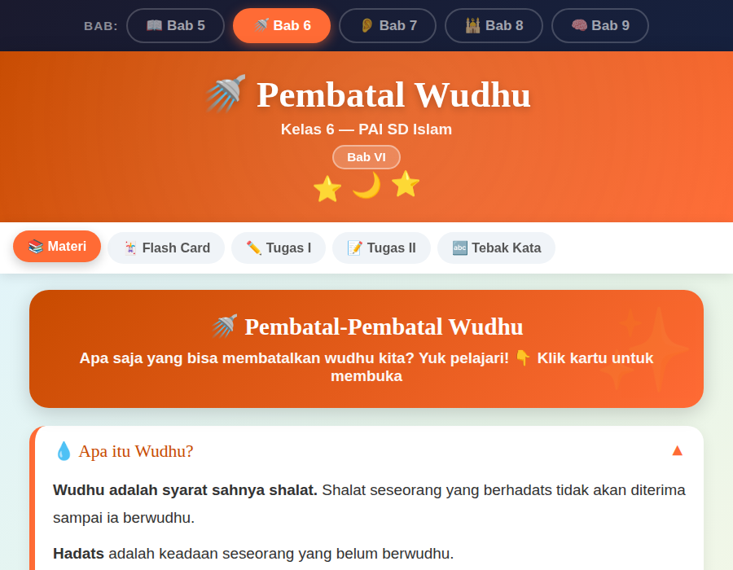

# 🕌 Belajar PAI — Kelas 1 SD Islam

Aplikasi web interaktif untuk belajar Pendidikan Agama Islam (PAI) Kelas 6 SD, mencakup Bab 5 hingga Bab 9. Dirancang agar siswa bisa belajar mandiri dengan tampilan yang menarik, berwarna, dan responsif di desktop maupun mobile.

---

## 📸 Tampilan Aplikasi

### Halaman Materi (Bab 5)


### Flash Card Dalil


### Kuis Pilihan Ganda (Tugas II)


### Tebak Kata (Word Match)


### Bab 6 — Pembatal Wudhu


---

## 📚 Konten Materi

| Bab | Judul | Warna Tema |
|-----|-------|-----------|
| Bab 5 | 🕌 Mengenal Allah Ta'ala | Teal / Biru |
| Bab 6 | 🚿 Pembatal Wudhu | Orange |
| Bab 7 | 👂 Allah Maha Mendengar (As-Sami') | Indigo |
| Bab 8 | 🕌 Shalat-Shalat Fardhu | Emerald / Hijau |
| Bab 9 | 🧠 Allah Maha Mengetahui (Al-'Aliim) | Crimson / Merah |

---

## ✨ Fitur

### 📖 Materi
Penjelasan materi lengkap dalam format accordion yang bisa dibuka-tutup. Dilengkapi animasi SVG interaktif (contoh: animasi matahari terbit, gerhana matahari) dan kotak dalil Arab beserta terjemahannya.

### 🃏 Flash Card
Kartu dalil dengan efek flip 3D. Sisi depan menampilkan ayat/dalil dalam tulisan Arab, sisi belakang menampilkan arti dan penjelasan lengkap. Bisa dinavigasi maju-mundur.

### ✏️ Tugas I — Klik & Pilih
Latihan interaktif dengan cara mengklik tag untuk memilih jawaban (misalnya: makhluk laut atau darat, batal atau tidak batal wudhu, benar atau salah). Klik 1× = pilihan pertama, klik 2× = pilihan kedua, klik 3× = hapus pilihan. Dilengkapi tombol **Periksa** dan skor otomatis.

### 📝 Tugas II — Kuis Pilihan Ganda
Soal pilihan ganda (a/b) sebanyak 20 soal per bab, diambil dari soal buku siswa. Tersedia feedback langsung (✅ Benar / ❌ Salah) setelah dicek, beserta skor akhir dan pesan motivasi.

### 🔤 Tebak Kata (Word Match)
Aktivitas mencocokkan kata/istilah ke kategori yang tepat. Pilih kata di kolom kiri, lalu klik kategori di kolom kanan. Jika salah, kartu akan bergetar (efek shake). Semua pasangan yang sudah cocok ditampilkan di bagian atas.

---

## 🗂️ Struktur File

```
index.html          # File tunggal, semua CSS + JS + konten di dalam satu file
ss_bab5_materi.png  # Screenshot halaman materi Bab 5
ss_flashcard.png    # Screenshot fitur Flash Card
ss_quiz.png         # Screenshot Tugas II (kuis)
ss_wordmatch.png    # Screenshot Tebak Kata
ss_bab6.png         # Screenshot Bab 6
README.md           # Dokumentasi ini
```

---

## 🚀 Cara Penggunaan

Tidak perlu instalasi apapun. Cukup buka file `index.html` di browser (Chrome, Firefox, Edge, Safari).

```
Klik dua kali pada index.html
```

Atau untuk membuka via terminal:

```bash
# Linux / macOS
open index.html

# Windows
start index.html
```

> **Catatan:** Font Google Fonts (Baloo 2 & Nunito) memerlukan koneksi internet untuk tampil optimal. Aplikasi tetap berfungsi secara offline, hanya font akan fallback ke sans-serif default.

---

## 🛠️ Teknologi

- **HTML5** — Struktur dan konten
- **CSS3** — Styling, animasi (keyframes), CSS variables, responsive layout
- **Vanilla JavaScript** — Logika interaktif, state management, render dinamis
- **SVG animasi** — Ilustrasi gerhana, matahari terbit, dll. (inline, tanpa library eksternal)
- **Google Fonts** — Baloo 2 & Nunito

Tidak menggunakan framework atau library eksternal apapun — 100% native HTML/CSS/JS dalam satu file.

---

## 📱 Responsif

Tampilan otomatis menyesuaikan layar mobile (≤500px) dengan ukuran font dan padding yang lebih kecil. Nav tab bisa di-scroll horizontal jika konten melebihi lebar layar.

---

## 🐛 Bug yang Diperbaiki

| # | Lokasi | Deskripsi | Status |
|---|--------|-----------|--------|
| 1 | JS line ~1347 | Duplikasi deklarasi `const fcIdx` menyebabkan `SyntaxError` dan seluruh script crash | ✅ Fixed |
| 2 | HTML line ~345 | Nav Bab 6 menggunakan class `bab5-nav` (seharusnya `bab6-nav`), menyebabkan warna tab aktif tidak muncul | ✅ Fixed |

---

## 👨‍🏫 Kredit

Dibuat untuk pembelajaran PAI SD Islam Kelas 1. Konten materi bersumber dari buku teks PAI SD Kelas 6 (referensi halaman tercantum di setiap flash card).
